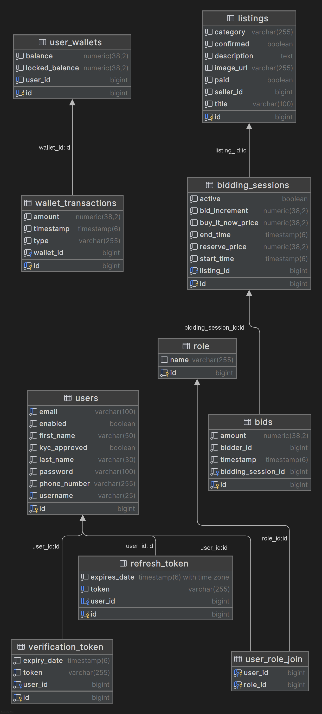
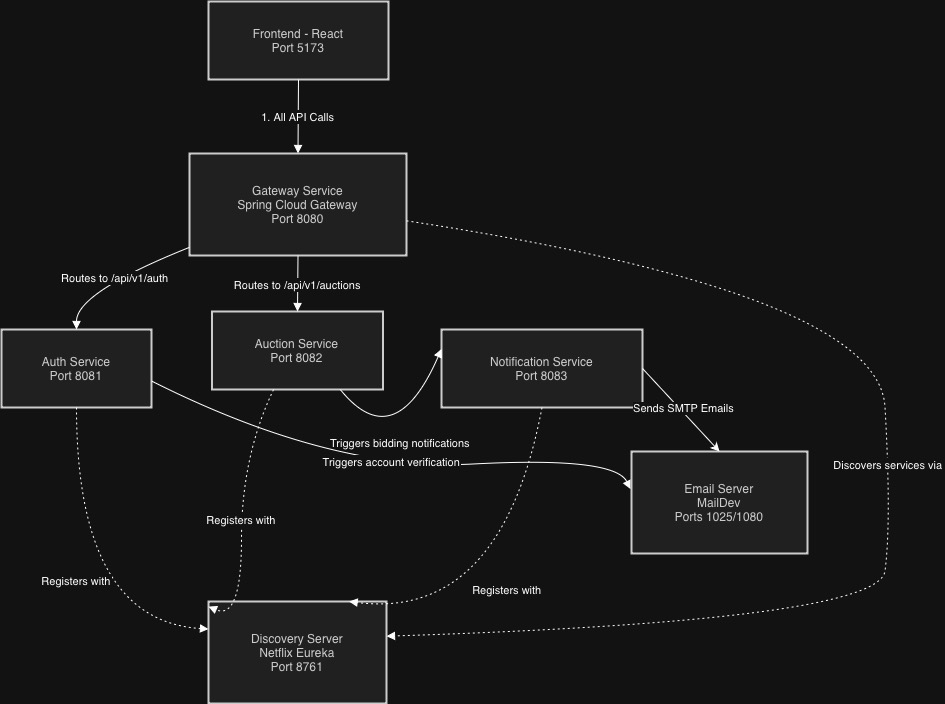
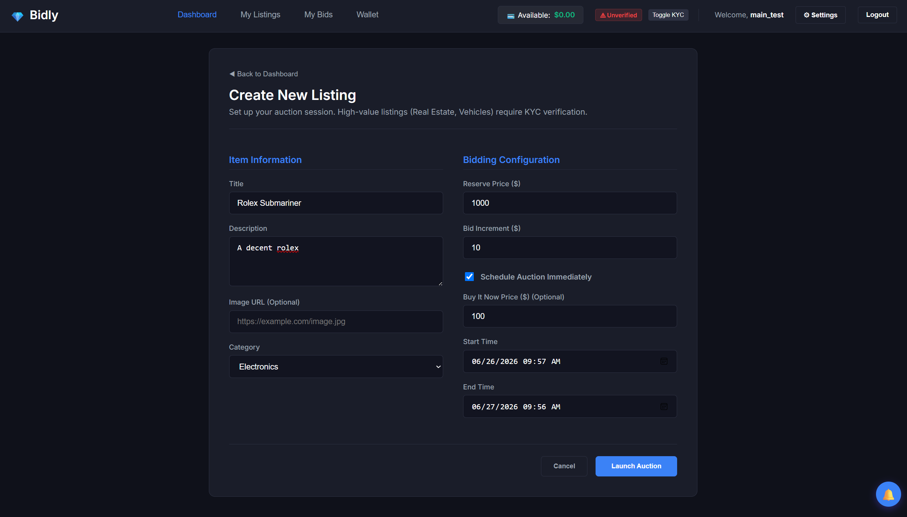
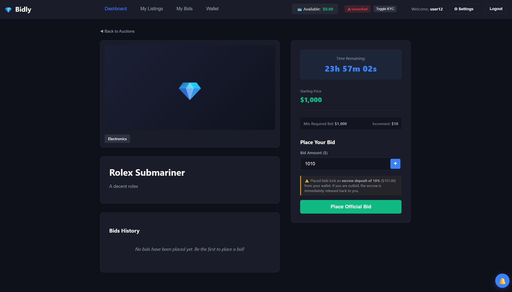
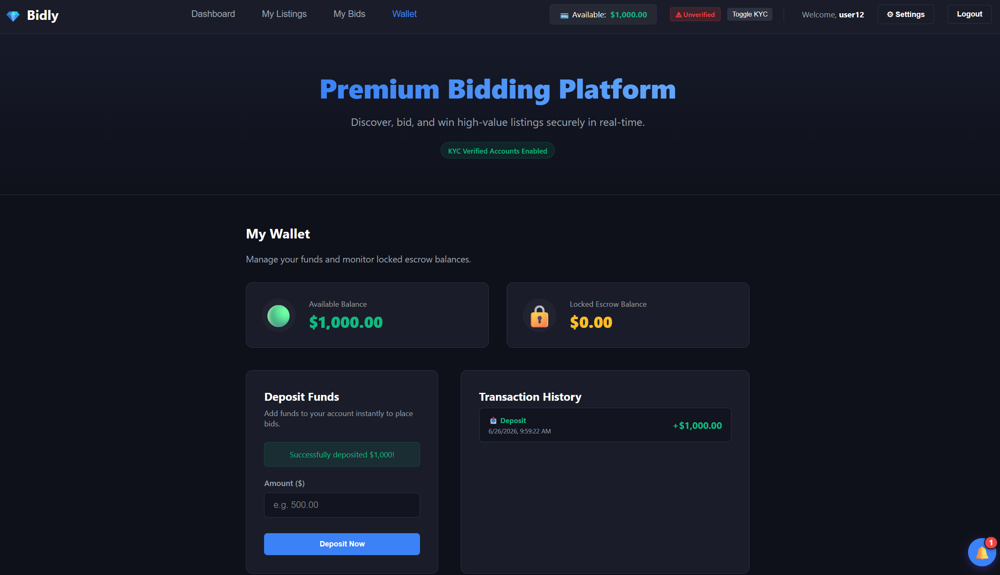

# Bidly

## Project Overview
Bidly is an online auction and bidding platform. It allows users to list items for sale, while other users can place live bids to compete and purchase those items through an auction system.

## Architecture
The application uses a Microservices Architecture. The Gateway Service acts as the single entry point (port 8080) and automatically routes every incoming API call to its corresponding backend microservice.

### ER Diagram


### System Diagram


### Port Configuration
* **Gateway Service**: Port `8080` (Routes all incoming requests)
* **Auth Service**: Port `8081` (Handles authentication & users)
* **Auction Service**: Port `8082` (Handles listings & bidding)
* **Notification Service**: Port `8083` (Handles emails & notifications)
* **Discovery Service (Eureka)**: Port `8761` (Service registry)
* **Frontend (React)**: Port `5173`

## Setup Instructions

### System Requirements
* **Java 21**
* **Spring Boot 3.3.1**
* **Docker** & **Docker Compose**
* **Node.js** (npm)

### Running Database Infrastructure (PostgreSQL)
The services connect to three separate PostgreSQL databases. You can spin them up using the following Docker commands:

1. **Auth Service Database (`auth_db` on port `5432`)**
   ```bash
   docker run -d --name auth-db -p 5432:5432 -e POSTGRES_DB=auth_db -e POSTGRES_USER=admin -e POSTGRES_PASSWORD=password123 postgres:latest
   ```
2. **Auction Service Database (`auction_db` on port `5433`)**
   ```bash
   docker run -d --name auction-db -p 5433:5432 -e POSTGRES_DB=auction_db -e POSTGRES_USER=admin -e POSTGRES_PASSWORD=password123 postgres:latest
   ```
3. **Notification Service Database (`notification_db` on port `5434`)**
   ```bash
   docker run -d --name notification-db -p 5434:5432 -e POSTGRES_DB=notification_db -e POSTGRES_USER=admin -e POSTGRES_PASSWORD=password123 postgres:latest
   ```

### Running Messaging & Observability Infrastructure
Once the databases are active, launch the other required third-party services:

1. **RabbitMQ Message Broker** (Port `5672` for communication, `15672` for dashboard)
   ```bash
   docker run -d --name rabbitmq -p 5672:5672 -p 15672:15672 rabbitmq:3-management
   ```
2. **Email Server (MailDev)** (Port `1025` SMTP, `1080` Web UI)
   ```bash
   docker run -d --name maildev -p 1025:1025 -p 1080:1080 maildev/maildev
   ```
3. **Observability Stack (Prometheus & Grafana)**
   Navigate to the `observability` directory and run:
   ```bash
   docker compose up -d
   ```

### Running the Backend Services
Start the Spring Boot microservices in the following recommended order (wait for Eureka and the Gateway to be fully healthy before starting other services):

1. **Discovery Service (Eureka)**
   ```bash
   cd discovery-service && ./mvnw spring-boot:run
   ```
2. **Gateway Service**
   ```bash
   cd gateway-service && ./mvnw spring-boot:run
   ```
3. **Auth Service**
   ```bash
   cd auth-service && ./mvnw spring-boot:run
   ```
4. **Auction Service**
   ```bash
   cd auction-service && ./mvnw spring-boot:run
   ```
5. **Notification Service**
   ```bash
   cd notification-service && ./mvnw spring-boot:run
   ```

### Running the Frontend
With all backend services running, install dependencies and start the React app:
```bash
cd frontend
npm install
npm run dev
```

### Useful Links

#### Application & Services
* **Frontend**: [http://localhost:5173/](http://localhost:5173/)
* **Eureka Dashboard**: [http://localhost:8761/](http://localhost:8761/)
* **MailDev**: [http://localhost:1080](http://localhost:1080)
* **RabbitMQ Dashboard**: [http://localhost:15672/](http://localhost:15672/) (Credentials: `guest` / `guest`)

#### Observability & Metrics
* **Actuator**: [http://localhost:8080/actuator/prometheus](http://localhost:8080/actuator/prometheus)
* **Prometheus Targets**: [http://localhost:9090/targets](http://localhost:9090/targets)
* **Grafana UI Home**: [http://localhost:3000](http://localhost:3000) (Default admin password: `admin`)


## API Documentation

All API requests should be sent to the Gateway Service at `http://localhost:8080`. The gateway dynamically routes incoming traffic to the appropriate downstream microservice based on the URL path.

### Routing Table
| Route Path | Downstream Service | Downstream Port | Protocol | Description |
| :--- | :--- | :--- | :--- | :--- |
| `/api/v1/auth/**` | **Auth Service** | `8081` | HTTP | Handles registration, authentication, token management, and user profiles |
| `/api/v1/users/**` | **Auth Service** | `8081` | HTTP | Internal user verification endpoints |
| `/api/v1/auctions/**` | **Auction Service** | `8082` | HTTP | Manages listings, bidding sessions, bids, and user wallets |
| `/ws/auctions` | **Auction Service** | `8082` | WebSocket | Broadcasts real-time auction, bidding, and transaction updates |

---

<details>
<summary><b>Auth Service API (/api/v1/auth & /api/v1/users)</b></summary>

### 1. Authentication Endpoints (`/api/v1/auth`)

| Method | Endpoint | Authorization | Description |
| :---: | :--- | :--- | :--- |
| `POST` | `/register` | Public | Register a new user account. Triggers a confirmation email. |
| `GET` | `/confirm` | Public | Confirm account registration. Query param: `token` (String). |
| `POST` | `/login` | Public | Authenticate username/password. Returns Access & Refresh tokens. |
| `POST` | `/refresh-token` | Public | Generate a new Access Token using a valid Refresh Token. |
| `POST` | `/logout` | `USER`, `ADMIN` | Log out the authenticated user and invalidate current tokens. |
| `GET` | `/users` | `ADMIN` | Retrieve all registered users. |
| `GET` | `/users/{id}` | `USER`, `ADMIN` | Get a specific user profile by ID. |
| `PUT` | `/users/{id}` | `USER`, `ADMIN` | Update user profile details (username, email, phone). |
| `DELETE` | `/users/{id}` | `USER`, `ADMIN` | Delete a user account by ID. |
| `POST` | `/users/{id}/kyc` | `ADMIN` | Approve or reject a user's KYC status. Query param: `approved` (boolean). |

#### 2. User Service Endpoints (`/api/v1/users`)

| Method | Endpoint | Authorization | Description |
| :---: | :--- | :--- | :--- |
| `GET` | `/{id}` | Public / Internal | Retrieve a specific user's public info (used for internal service-to-service validation). |

<br>

#### Request & Response Schemas (DTOs)

##### **Register Request (`POST /register`)**
```json
{
  "firstName": "John",
  "lastName": "Doe",
  "username": "johndoe",
  "email": "john.doe@example.com",
  "password": "Password123!",
  "phoneNumber": "0712345678"
}
```

##### **Register Response**
```json
{
  "message": "User registered successfully. Please check your email to confirm your account.",
  "email": "john.doe@example.com"
}
```

##### **Login Request (`POST /login`)**
```json
{
  "username": "johndoe",
  "password": "Password123!"
}
```

##### **Login Response**
```json
{
  "id": 1,
  "username": "johndoe",
  "email": "john.doe@example.com",
  "accessToken": "eyJhbGciOi...",
  "refreshToken": "d3b07384...",
  "kycApproved": false
}
```

##### **Token Refresh Request (`POST /refresh-token`)**
```json
{
  "refreshToken": "d3b07384-..."
}
```

##### **Token Refresh Response**
```json
{
  "accessToken": "eyJhbGciOi...",
  "refreshToken": "d3b07384-..."
}
```

##### **Update User Request (`PUT /users/{id}`)**
```json
{
  "username": "newusername",
  "email": "new.email@example.com",
  "phoneNumber": "0799999999"
}
```

##### **User Response (`GET /users/{id}`)**
```json
{
  "id": 1,
  "username": "johndoe",
  "email": "john.doe@example.com",
  "enabled": true,
  "kycApproved": true,
  "phoneNumber": "0712345678"
}
```

</details>

<details>
<summary><b>Auction Service API (/api/v1/auctions)</b></summary>

### 1. Listing Endpoints (`/api/v1/auctions/listings`)

| Method | Endpoint | Authorization | Description |
| :---: | :--- | :--- | :--- |
| `POST` | `/` | `USER`, `ADMIN` | Create a new auction listing. |
| `GET` | `/` | `USER`, `ADMIN` | Get all listings paginated. Params: `page` (default 0), `size` (default 10), `sort` (default `id,desc`). |
| `GET` | `/{id}` | `USER`, `ADMIN` | Get details of a single listing. |
| `PUT` | `/{id}` | `USER`, `ADMIN` | Update details of a listing. |
| `DELETE` | `/{id}` | `USER`, `ADMIN` | Delete/cancel a listing. |
| `DELETE` | `/seller/{sellerId}` | System / Internal | Deactivates all active listings owned by a specific seller. |
| `POST` | `/{id}/confirm` | `USER`, `ADMIN` | Confirms or rejects a completed listing sale. Query params: `sellerId` (Long), `confirm` (boolean). |
| `POST` | `/{id}/checkout` | `USER`, `ADMIN` | Finalizes a completed listing checkout. Query params: `winnerId` (Long). |
| `POST` | `/{id}/forfeit` | `USER`, `ADMIN` | Handle a buyer forfeiting their winning bid (releases locked escrow, updates listing status). |
| `POST` | `/{id}/schedule` | `USER`, `ADMIN` | Schedule an auction's start/end dates and Buy-It-Now price. |

#### 2. Bidding Endpoints (`/api/v1/auctions/listings/{listingId}/bids`)

| Method | Endpoint | Authorization | Description |
| :---: | :--- | :--- | :--- |
| `POST` | `/` | `USER` | Place a bid on a listing. Escrow funds will be locked automatically. |
| `GET` | `/` | `USER`, `ADMIN` | Get bids for a listing paginated. Params: `page` (default 0), `size` (default 10), `sort` (default `amount,desc`). |
| `GET` | `/{bidId}` | `USER`, `ADMIN` | Get details of a single bid. |
| `DELETE` | `/{bidId}` | `USER`, `ADMIN` | Delete a bid by ID. |

#### 3. Bidding Session Endpoints (`/api/v1/auctions/sessions`)

| Method | Endpoint | Authorization | Description |
| :---: | :--- | :--- | :--- |
| `GET` | `/{id}` | `USER`, `ADMIN` | Get details of a specific bidding session. |
| `PUT` | `/{id}` | `USER`, `ADMIN` | Update an existing bidding session (times, reserve price, bid increment). |
| `DELETE` | `/{id}` | `USER`, `ADMIN` | Delete a bidding session. |

#### 4. Wallet Endpoints (`/api/v1/auctions/wallets/{userId}`)

| Method | Endpoint | Authorization | Description |
| :---: | :--- | :--- | :--- |
| `GET` | `/` | `USER` | Fetch or create a user's wallet with balance, locked funds, and transaction history. |
| `POST` | `/deposit` | `USER` | Deposit funds to wallet. Request body: `WalletDepositRequest`. |
| `GET` | `/transactions` | `USER` | Get user wallet transactions paginated. Params: `page` (0), `size` (10), `sort` (`timestamp,desc`). |
| `PUT` | `/` | `USER` | Update user wallet balance/locked balance directly (Admin/System). |
| `DELETE` | `/` | `USER`, `ADMIN` | Delete a user's wallet by user ID. |
| `GET` | `/transactions/{transactionId}` | `USER`, `ADMIN` | Get details of a single transaction by ID. |

<br>

#### Request & Response Schemas (DTOs)

##### **Listing Request (`POST /api/v1/auctions/listings`)**
```json
{
  "title": "Vintage Handcrafted Leather Watch",
  "description": "Mint condition 1980s mechanical chronograph watch.",
  "imageUrl": "https://example.com/watch.jpg",
  "category": "Collectibles",
  "sellerId": 2,
  "startTime": "2026-06-26T10:00:00",
  "endTime": "2026-07-03T10:00:00",
  "reservePrice": 150.00,
  "buyItNowPrice": 450.00,
  "bidIncrement": 10.00
}
```

##### **Listing Response**
```json
{
  "id": 1,
  "title": "Vintage Handcrafted Leather Watch",
  "description": "Mint condition 1980s mechanical chronograph watch.",
  "imageUrl": "https://example.com/watch.jpg",
  "category": "Collectibles",
  "sellerId": 2,
  "confirmed": false,
  "paid": false,
  "biddingSession": {
    "id": 1,
    "startTime": "2026-06-26T10:00:00",
    "endTime": "2026-07-03T10:00:00",
    "reservePrice": 150.00,
    "buyItNowPrice": 450.00,
    "bidIncrement": 10.00,
    "active": true,
    "currentHighestBid": 0.00,
    "currentHighestBidderId": null,
    "bids": []
  }
}
```

##### **Bid Request (`POST /api/v1/auctions/listings/{listingId}/bids`)**
```json
{
  "bidderId": 3,
  "amount": 160.00
}
```

##### **Bid Response**
```json
{
  "id": 1,
  "biddingSessionId": 1,
  "bidderId": 3,
  "bidderUsername": "buyer_jane",
  "amount": 160.00,
  "timestamp": "2026-06-26T11:15:30"
}
```

##### **Wallet Deposit Request (`POST /api/v1/auctions/wallets/{userId}/deposit`)**
```json
{
  "amount": 500.00
}
```

##### **Wallet Response (`GET /api/v1/auctions/wallets/{userId}`)**
```json
{
  "userId": 3,
  "balance": 340.00,
  "lockedBalance": 160.00,
  "transactions": [
    {
      "id": 1,
      "amount": 500.00,
      "type": "DEPOSIT",
      "timestamp": "2026-06-26T11:00:00"
    },
    {
      "id": 2,
      "amount": 160.00,
      "type": "LOCK",
      "timestamp": "2026-06-26T11:15:30"
    }
  ]
}
```

</details>

<details>
<summary><b>Real-Time WebSocket API (ws://localhost:8080/ws/auctions)</b></summary>

The client can connect to the gateway websocket endpoint at `ws://localhost:8080/ws/auctions` (internally routed to `ws://localhost:8082/ws/auctions`) to receive real-time JSON event broadcasts.

#### Broadcast Event Formats

##### 1. **New Bid Placed (`BID_PLACED`)**
Fired when a user places a valid bid. (Triggers anti-sniping time extension if placed in the last 5 minutes of an auction).
```json
{
  "type": "BID_PLACED",
  "listingId": 1,
  "amount": 160.00,
  "bidderId": 3,
  "endTime": "2026-07-03T10:00:00",
  "currentHighestBid": 160.00,
  "active": true
}
```

##### 2. **Auction Closed (`AUCTION_ENDED`)**
Fired when an auction session's duration expires or its Buy-It-Now price is met.
```json
{
  "type": "AUCTION_ENDED",
  "listingId": 1,
  "active": false
}
```

##### 3. **Wallet Transaction Update (`WALLET_TRANSACTION`)**
Fired when user wallet balance changes. Helpful for rendering live HUD/balance updates on the client UI.
```json
{
  "type": "WALLET_TRANSACTION",
  "userId": 3,
  "txType": "DEPOSIT", // Can be "DEPOSIT", "LOCK", "RELEASE", "CHARGE"
  "amount": 500.00,
  "message": "Successfully deposited $500.00 to your wallet!"
}
```

</details>

<details>
<summary><b>Asynchronous Notifications (RabbitMQ Messaging)</b></summary>

Downstream communication is asynchronous and handled via RabbitMQ. When events happen in the **Auction Service**, they are published to the `notification-exchange` exchange, which routes them to the `notification-queue` consumed by the **Notification Service**.

#### Event Types & Email Actions:

* **`BID_PLACED`**: Sends a confirmation email to the bidder stating that their bid was successfully placed.
* **`OUTBID`**: Sent to the previous highest bidder, alerting them that they have been outbid and provides the new highest bid amount.
* **`AUCTION_ENDED`**: Sent to the winner and the seller summarizing the auction final price and checkout instructions.

If the email server (MailDev) is active, emails are sent using JavaMailSender. If offline, the notification service logs the generated email body to standard output.

</details>

## Screenshots

Below are browser screenshots and visual system models illustrating the Bidly application interface:

### System Architecture Diagram


### Listings Creation


### Bidding Page


### Wallet and Deposits


## Member Contributions


The contributions matrix for the Bidly development team:

| Team Member               | Roles & Responsibilities | Key Contributions |